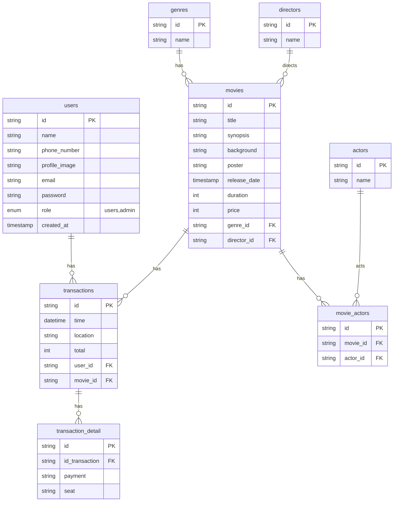

# ERD DIAGRAM MOVXTAR

```mermaid
erDiagram
    users ||--o{ transactions : has
    movies ||--o{ transactions : has
    genres ||--o{ movies : has
    directors ||--o{ movies : directs
    actors ||--o{ movie_actors : acts
    movies ||--o{ movie_actors : has
    transactions || --o{ transaction_detail :has

    users {
        string id PK
        string name
        string phone_number
        string profile_image
        string email
        string password
        enum role "users,admin"
        timestamp created_at
    }

    movies {
        string id PK
        string title
        string synopsis
        string background
        string poster
        timestamp release_date
        int duration
        int price
        string genre_id FK
        string director_id FK
    }

    transactions {
        string id PK
        datetime time
        string location
        int total
        string user_id FK
        string movie_id FK
    }
    transaction_detail{
        string id PK
        string id_transaction FK
        string payment
        string seat

    }

    directors {
        string id PK
        string name
    }

    genres {
        string id PK
        string name
    }

    actors {
        string id PK
        string name
    }

    movie_actors {
        string id PK
        string movie_id FK
        string actor_id FK
    }


```
