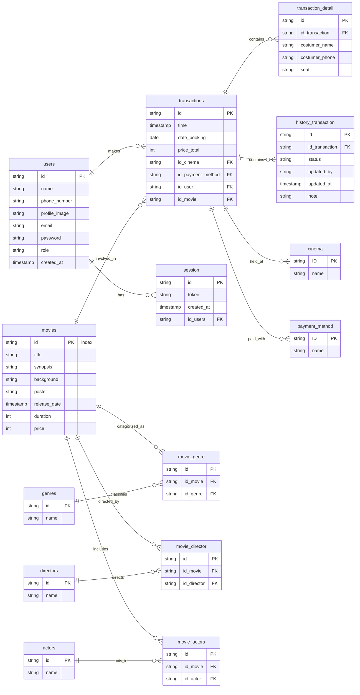

# ERD DIAGRAM MOVXTAR

This project is a backend database schema for a cinema ticket booking application. It includes user management, movie listings, genre classifications, director and actor mappings, cinema information, transactions, and detailed purchase history.

